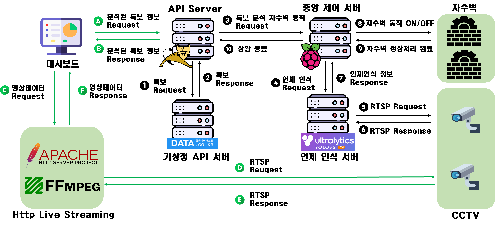

# 공공API를 이용한 자동화 시스템 대시보드
### 해당 프로젝트는 Dev.OOPS!팀의 공공API를 이용한 자동화시스템의 대시보드입니다.

(프로토 타입)
# 대시보드 개발 이유
현재 원격에서 제어하고있는 환경들에 점검이 잘 이루어지지 않고 있다.
실제 2023년 많은 폭우가 왔을때 터널에 설치되있는 유압기(?)가 작동하지 않아 터널이 수몰되는 사건이 발생하였다. 이를 관측할 수 있는 방법이 없었기 때문에 생긴 문제라고 생각한다. 
따라서 Dev.OOPS!팀의 공공API를 이용한 자동화 시스템에는 중앙에서 상황을 관제할 수 있는 대시보드를 제시한다.
# 대시보드 이용시 장점
~~~~
1. 원격 관측
2. 데이터 시각화
~~~~
# 사용 라이브러리

 

# 전체 시스템 아키텍처

# 대시보드 기능
1. 실시간 관측 데이터 열람
2. 각 지역의 CCTV확인가능.
3. HLS 서버 사용으로 CCTV다중 접속. 1